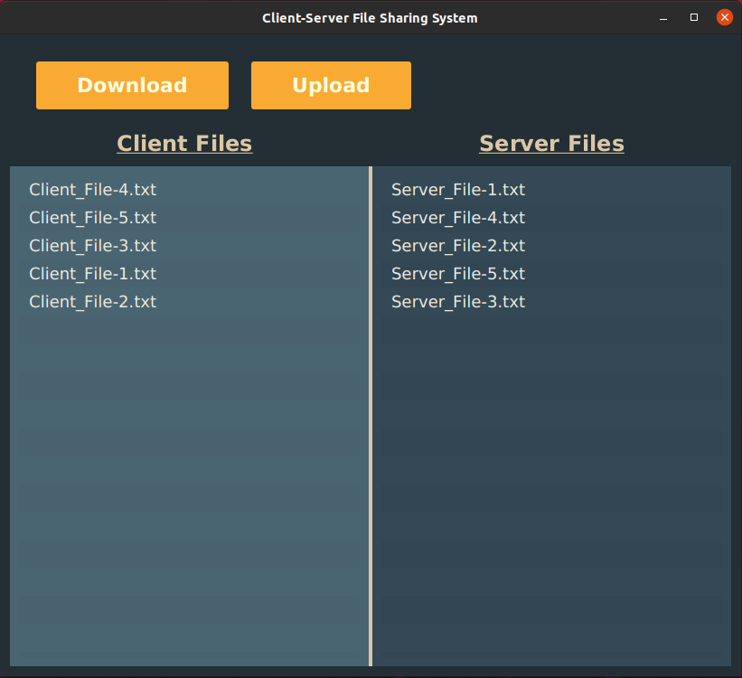

# Client-Server File Sharing System

### Description:
Clients connect to a central server, which responds to a single client command, and then disconnects.
Every command issued by a client will re-connect to the server before sending the command.

Client connections are handled, each with a separate thread.

### Improvements:
___
* CSS Styling
* Adjustable directory width (drag middle bar)
* Mnemonic Parsing (Keyboard Shortcuts)
   * Exit: CTRL + W
   * Download: CTRL + D
   * Upload: CTRL + E
* Multiple file upload/download (auto-refresh scene)

### Screenshots
___

### Instructions:
___
*Prerequisites: JDK 15+, JAVAFX 15+*
1. Clone the repository
2. Open the project in an IDE (IntelliJ Idea is recommended)
3. Navigate to 'File-Project Structure
   1. Navigate to 'Project' and add the Java 15 SDK
   2. Navigate to 'Global Libraries' and add JavaFX 15 to modules
4. Edit run configurations
    1. Add an application template, modify it to direct to 'sample.Main'
       1. Add VM options and paste in this line `--module-path "path-to-lib" --add-modules javafx.controls,javafx.fxml`
     2. Add an application template, modify it to direct to sample.server.Server
5. Program should now run
    1. Run the Server first
    2. Followed by Main

#### Known Issues:

- Files tend to fail to upload/download, works after multiple tries.

### By: Ajmain Khan